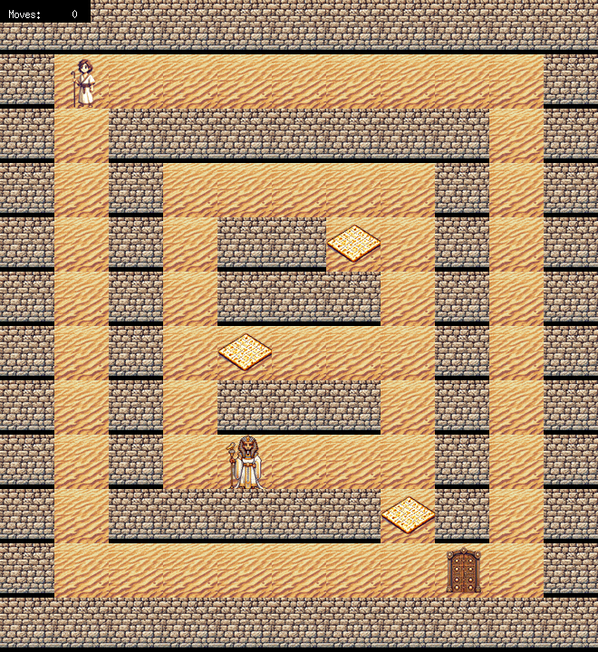
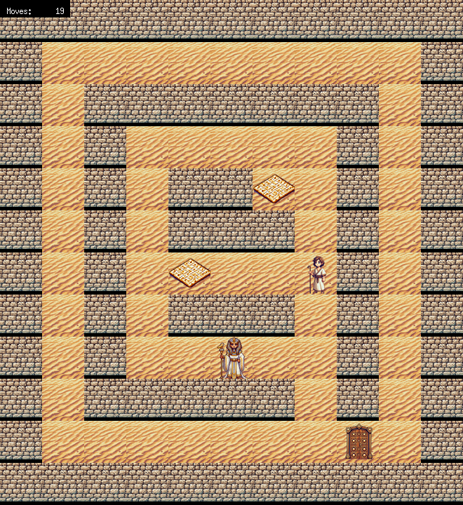
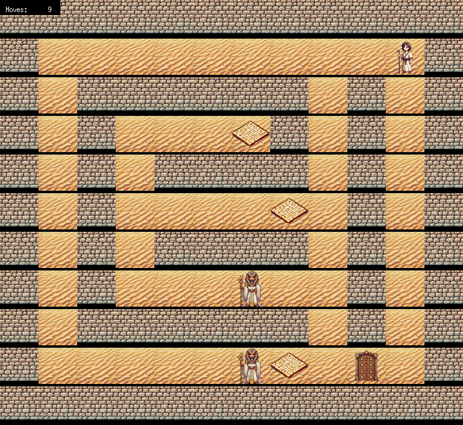

_This project has been created as part of the 42 curriculum by mteichma._

# so_long

A small top-down 2D game in C with MiniLibX: load a tile map from a `.ber` file, pick up every collectible, then reach the exit without touching a patrolling enemy.



## What it does

- **Map format.** A `.ber` file is a rectangle of characters (here `maps/maps_ok/map1.ber`, the map in the GIF): `1` wall, `0` floor, `P` player start, `C` collectible, `E` exit, `X` enemy. The name must end in exactly `.ber`.

  ```
  11111111111
  1P000000001
  10111111101
  10100000101
  101011C0101
  10101110101
  1010C000101
  10101110101
  1010000X101
  1011111C101
  10000000E01
  11111111111
  ```

- **Validation.** Before any window opens, the map is rejected with `Error` and a reason if it is not rectangular, contains another character, does not have exactly one `P`, exactly one `E` and at least one `C`, is not closed by walls on every border cell, or if some `C` or the `E` cannot be reached from `P`. The program then exits with status 1. `maps/` holds one file per error case (`test2_no_exit.ber` to `test9_no_path.ber`, `not_ber.txt`) and a valid `test1.ber`; `maps/maps_ok/` holds five more playable maps.
- **Rules.** `W`, `A`, `S`, `D` move one tile per key press; walls block. Walking onto a `C` collects it. The exit stays closed, and blocks movement, until every `C` is collected; stepping on the open exit prints `You Win!`. Touching an enemy prints `Game Over`. In both cases the player sprite changes, input stops, and the window closes by itself a moment later. `Esc` or the window's close button quits.
- **Move counter.** Every move prints `Mouvements : N` on stdout and updates a `Moves: N` counter in the top-left corner of the window.
- **Enemies and animations.** Each `X` walks left and right along its row and turns around at walls. The player (idle), collectibles and enemies alternate between two sprites, and the exit has closed and open sprites.
- **Window size.** Tiles are 64 px; the window is capped at 1280x720 and the tile size shrinks to fit larger maps.

## Screenshots

| `map1.ber`, 19 moves, two collectibles left | `map2.ber`, two enemies |
| --- | --- |
|  |  |

Captured on Debian under Xvfb from the current code.

## How it works

```
main
 ├─ check_args                  argument count, ".ber" extension, open()
 │   └─ read_and_parse_map
 │       ├─ store_lines           get_next_line, blank lines skipped
 │       ├─ check_rectangular
 │       ├─ parse_lines           characters, P/E/C counts, enemies
 │       └─ validate_map_content  counts, border walls, is_path_valid
 └─ init_window                 window, off-screen buffer, 14 XPM sprites, hooks, mlx_loop
```

**Parsing** (`map_reader.c`, `map_parser.c`): lines are read with `get_next_line` into a growing array, the width comes from the first line, and every line must match it. `parse_lines` copies each character into the grid, counts `P`, `E` and `C`, and moves every `X` into a separate `t_enemy` array, leaving floor in its cell.

**Path check** (`path_check.c`): the grid is copied and a recursive four-way flood fill starts at `P`, marking every non-wall cell it reaches. The map is valid only if every `C` and the `E` of the original grid are marked in the copy.

**Rendering loop** (`enemy.c`, `render_map.c`, `render_entities.c`): `mlx_loop_hook` calls `update_game` on every loop iteration. It advances a frame counter, moves the enemies every 30 iterations, checks whether an enemy shares the player's tile, then redraws: every tile, then the enemies, then the player are copied into one off-screen MLX image, which is pushed to the window with a single `mlx_put_image_to_window`. The move counter is drawn on top with `mlx_string_put`.

**Event hooks** (`window.c`, `events.c`, `player_movement.c`): `KeyPress` calls `handle_keypress`, which maps the X11 keysyms of `Esc` and `W/A/S/D` to `close_game` or `move_player`; `DestroyNotify` (the close button) calls `close_game`. `move_player` checks `can_move_to`, updates the position and the counter, collects an item, and checks for victory.

## Build and run

Linux with an X11 session. MiniLibX is vendored in `mlx_linux/` and built by the Makefile.

```sh
sudo apt install gcc make libx11-dev libxext-dev zlib1g-dev     # Debian/Ubuntu
make                                    # builds Libft, MiniLibX, then ./so_long
./so_long maps/maps_ok/map1.ber
./so_long maps/test9_no_path.ber        # Error / No valid path to all collectibles or exit
```

Targets: `all` (default), `bonus` (same as `all`: enemies, animations and the on-screen counter are always built), `clean`, `fclean`, `re`. Flags: `gcc -Wall -Wextra -Werror`.

## Design choices and hard parts

- **Validate everything before opening a window** (`file_checks.c`, `map_reader.c`, `map_validator.c`): all map errors are found before `mlx_init`, so a bad map never opens a window, and the whole file is checked before any MiniLibX resource exists.
- **One off-screen buffer per frame** (`render_map.c`, `render_entities.c`): `blit_img` copies sprite pixels straight into a single MLX image in layer order (tiles, enemies, player), then the frame is displayed once. This avoids flicker and one `mlx_put_image_to_window` call per tile.
- **Enemies kept out of the grid** (`map_parser.c`, `enemy.c`): an `X` becomes floor in the map and a `t_enemy` entry with a direction, so enemies can cross collectibles and the exit without erasing them, and the path check does not treat them as walls.
- **Flood fill on a copy** (`path_check.c`): the fill writes `F` into a duplicate grid, so the playable map is never modified by validation.
- **Frame counter as the only clock** (`enemy.c`, `render_entities.c`): enemy steps, sprite animation and the delay before closing after a win or a loss are all derived from one `global_frame` counter.

## Limitations

- **Speed depends on the machine.** Enemy moves, animations and the end-of-game delay count loop iterations (every 30, and 240 before closing), not time.
- **Sprites are cropped, not scaled.** `blit_img` always copies a `tile_size` square, but the sprites are 64x60 and the wall 64x55: the missing rows come out black, which gives the dark bands under the tiles in the screenshots. When a large map shrinks the tiles, sprites are cut instead of resized.
- **The exit is walkable for the path check only.** The flood fill passes through `E`, but `can_move_to` blocks the closed exit, so a map whose only route to a `C` crosses the exit is accepted and cannot be finished.
- **Blank lines are ignored anywhere in the file**, so a map split by an empty line is accepted as if the rows were joined, and an empty file exits with status 1 without printing `Error`.
- **Linux and WASD only.** Keysyms are hard-coded in `events.c` (no arrow keys, no macOS keycodes). The `player_move_*` sprites are loaded but never drawn. The flood fill is recursive and map size is not capped, so a very large open map could overflow the stack.

## Resources

- [MiniLibX for Linux](https://github.com/42Paris/minilibx-linux), vendored here in `mlx_linux/`, and the community [MiniLibX documentation](https://harm-smits.github.io/42docs/libs/minilibx).
- [Flood fill](https://en.wikipedia.org/wiki/Flood_fill): the four-way recursive variant used for the path check.
